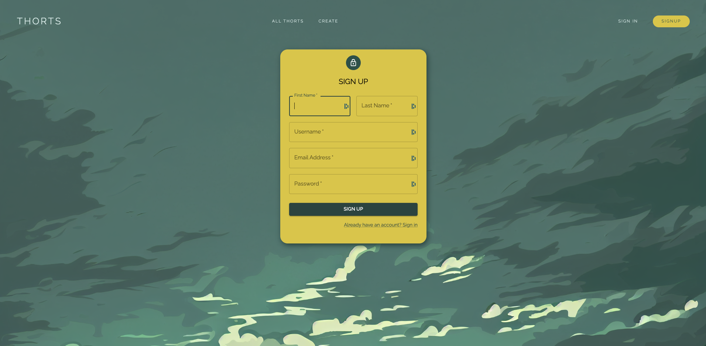
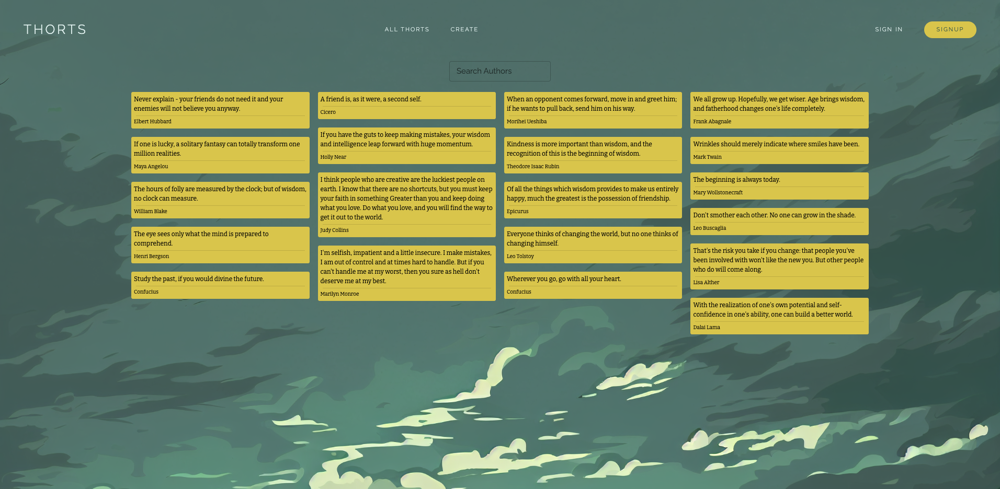
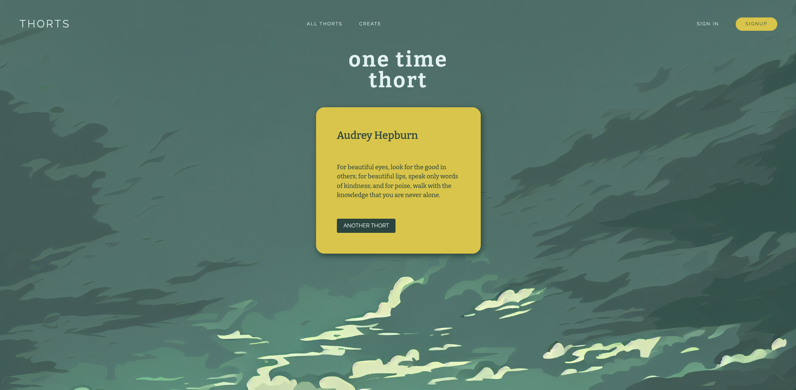

*Note: As of June 2023, the 'Add a Thought' and user functionality has been discontinued due to the sunsetting of Bit.io, I will try and change the database provider but I have other projects ongoing that are a higher priority.*

*The quotes are now fetched on the frontend from a reliable quotes API to keep the app running, I will not continue to fix the database issue as I used another project called Resorts Project which uses the same technology and shows a similar process. The project can be found here - [Resorts Project](https://github.com/robwilhelmsson/resort-info)*

# Thorts Project

This repository contains the source code for a full-stack application designed to provide users with quotes and inspirational thoughts. The application allows users to view all the available quotes or search for quotes by author. Users can also create an account, sign in, and add their own quotes to the database.

The app can be found here - [Thorts Project](https://thorts.netlify.app/)

## Technologies Used

- Frontend:
  - React
  - React Router Dom
  - Material UI
  - Axios

- Backend:
  - Python
  - Flask
  - Flask Marshmallow
  - SQLAlchemy
  - JWT

## Project Overview

The Thorts Project is a full-stack application that aims to inspire users with a collection of quotes and thoughts. Users can browse through existing quotes, search for quotes by author, and create an account to contribute their own quotes to the database. The application leverages a PostgreSQL database hosted on *Bit.io* to store and retrieve user data.

## Features

- Browse Quotes: Users can explore a wide range of quotes and thoughts from various authors, providing inspiration and motivation.

- Search by Author: Users can search for quotes by a specific author, making it easy to find quotes from their favorite writers.

- User Authentication (discontinued): ~~Users can create an account and sign in to access personalized features. Authentication is implemented using JWT, ensuring secure access to user-specific data.~~

- Add Quotes (discontinued): ~~Users can contribute to the collection by adding their own quotes to the database.~~

- Design: The application is designed using Material UI, creating an aesthetically pleasing interface that enhances the user experience. Material UI was a good base and made styling quicker and easier. The design came from Midjourney AI where I asked it to create a modern minimilaistic look for the front page, and then I extracted the theme for other pages on thr app.

 

 

 

Feel free to explore the code for any specifics or implementation.

For more information, don't hesitate to get in touch.